# 教育訓練課程小幫手

這是一個使用 Blazor 開發出來的專案，提供輔助教育訓練課程之用

最近正在進行 Microsoft 微軟開發出來的新一代 Web Framework 開發框架，那就是 [Blazor](https://docs.microsoft.com/zh-tw/aspnet/core/blazor/?WT.mc_id=DT-MVP-5002220)，在這個時間點，微軟僅推出 Blazor Server Side 伺服器端 的開發框架工具，至於 WebAssembly 的用戶端工具，需要等到 2020 年之後才會推出；從微軟官方的文件中，可以看到 Blazor 會有幾個功能：裝載模型、範本、元件、生命週期、表單和驗證、元件程式庫、版面配置、相依插入、路由、JavaScript Interop、安全性及身分識別、狀態管理、錯誤處理、偵錯、呼叫 Web API 等技術。

作者本身並不具備網站開發能力，也就是說，我本身並沒有實際開發過一個網站專案程式，我的技術背景是從事於行動裝置應用程式 App 的開發，原則上，我都會使用 .NET Framework 平台與 C# 程式語言作為開發技術首選，當然，我自己對於 Xamarin.Forms 這個跨平台開發工具十分的孰悉；不過，我對於 HTML / CSS / Bootstrap / JavaScript 僅具有基本的認識，然而，因為沒有實際的網站開發實戰經驗，所以，這些 Web 開發技術通常僅是有看過相關文件與資料而已，若真的需要實際使用這些工具來開發網站專案，真正的結果只有不斷的撞牆、碰壁、上網找解決方案、不斷的 Try Error 而言。

所以，在 2018 年的時候，我看到了 Blazor 這個開發技術，我的眼睛為之一亮，這不是我正要找尋的開發技術嗎？(雖然，之前有嘗試要使用 XAML 相關的網站開發技術來進行網頁開發，不過，總是會有許多不安的感覺)，因為，想要透過 Blazor 這套開發框架來進行網站開發，僅需要精通 C# 程式語言、HTML 宣告標記語言與 Bootstrap 的使用方式，這樣就夠了，可是，這樣真的就已經足夠了嗎？那時，心中存在著滿滿的懷疑。不過，我還是在 Blazor 還是實驗性版本的時候，嘗試了幾個開發技術，整體開發感覺上覺得驚豔，因為，我不再需要去學 JavaScript 程式語言，也不要擔心要選擇哪套 JavaScript 開發框架： jQuery, Angular , Reac , Vue 等等，也不再需要去擔心繁雜的 Web 開發工具的使用方式，我都可以把它拋諸腦後。

可是，事實真的是正樣嗎？不過，等待還是有價值的，在 2019 年 9 月，微軟正式推出 伺服器端的 Blazor 開發框架工具，我便開始想要來進行網站開發實戰體驗，那麼，到底要選擇甚麼樣的題目來做為專案開發的標的呢？因為這幾年都在從事於 Xamarin.Forms 的教育訓練工作，通常在上課的時候，會想要提供上課學員一個好的學習體驗，那個時候就想要設計一個 教育訓練課程小幫手 這樣的應用程式，我想過要使用 Xamarin.Forms 來開發，可是，畢竟，開發成為 Web 類型的專案，更適合於上課學員的使用，因此，我就決定要開發出一套 教育訓練課程小幫手 網站應用程式。

這套 教育訓練課程小幫手 應用程式要具備後台專案的 CRUD Create Retrive Update Delete 新增 查詢 修改 刪除的功能開發、分頁顯示、也要將輸入的資料寫入到資料庫內、當要輸入資料的時候，可以使用彈出對話窗 Modal Dialog 讓使用者輸入資料、使用者可以進行登入/登出的身分驗證操作、尚未登入的使用者無法看到需要授權的網頁、已經登入的使用者僅能夠看到這個帳號授權可以看到的網頁、對於某些網頁而言，不同登入成功的帳號，將會看到不同的畫面內容、無需使用 JavaScript 與其相關 JavaScript Framework。我想，這樣的目標設定若能夠使用 Blazor 這套工具開發出來，我想， Blazor 這套工具，對於 .NET C# 開發者而言，應該是足以適任作為網站開發首選工具，因為，開發網站的時候，終於可以與 JavaScript 說聲掰掰了。

底下是這套 教育訓練課程小幫手 專案，佈署在 Azure 平台上的執行結果截圖

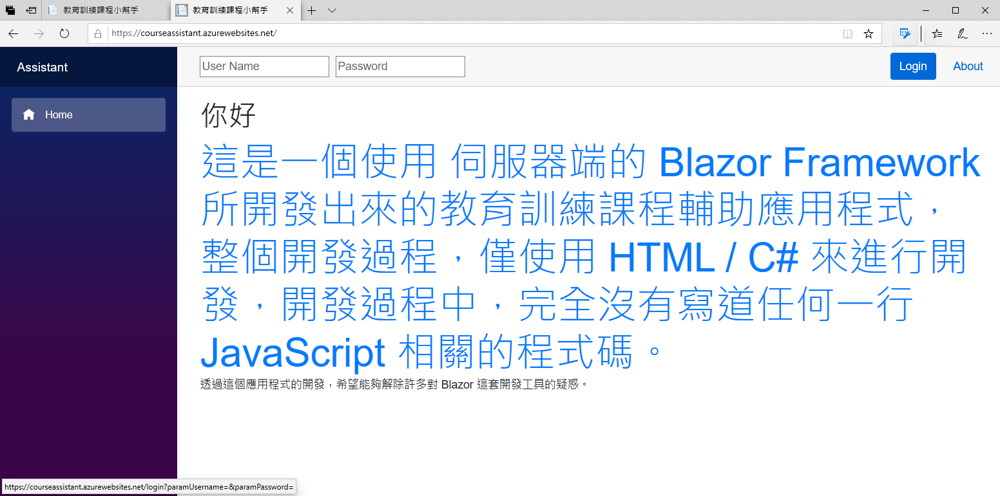

## 身分驗證與授權

這個畫面為沒有任何使用登入的狀態下，在網頁左邊的功能表，僅會看到首頁這個功能選項，現在可以在網頁上方輸入帳號與密碼，接著點選 Login 按鈕，進行登入作業。

底下截圖為管理者身分的使用者成功登入後的畫面。

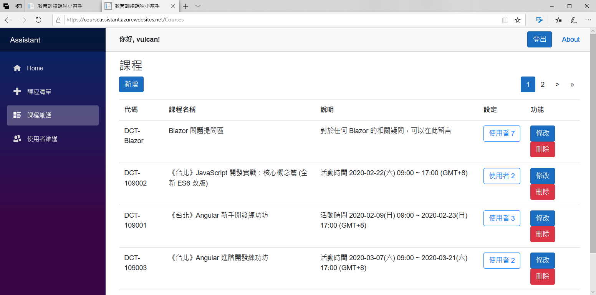

當管理者角色帳號成功驗證之後，將會看到所有前台與後台的相關功能(在網頁的最左邊)

底下截圖為一般使用者身分的使用者成功登入後的畫面。

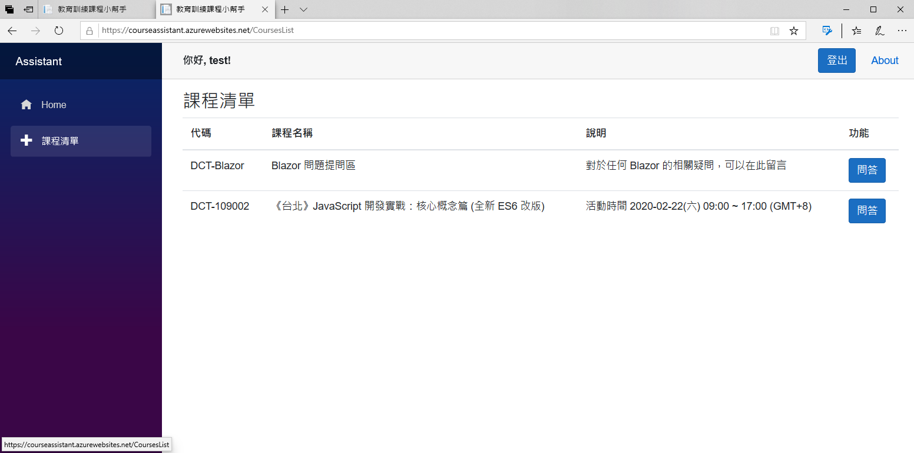

當一般角色帳號成功驗證之後，將會看到所有前台的相關功能(在網頁的最左邊)

就算這個時候，使用者以一般身分使用者進行登入，自行輸入 [https://courseassistant.azurewebsites.net/Courses](https://courseassistant.azurewebsites.net/Courses) 或者 [https://courseassistant.azurewebsites.net/Users](https://courseassistant.azurewebsites.net/Users) 網址，將會出現底下畫面截圖

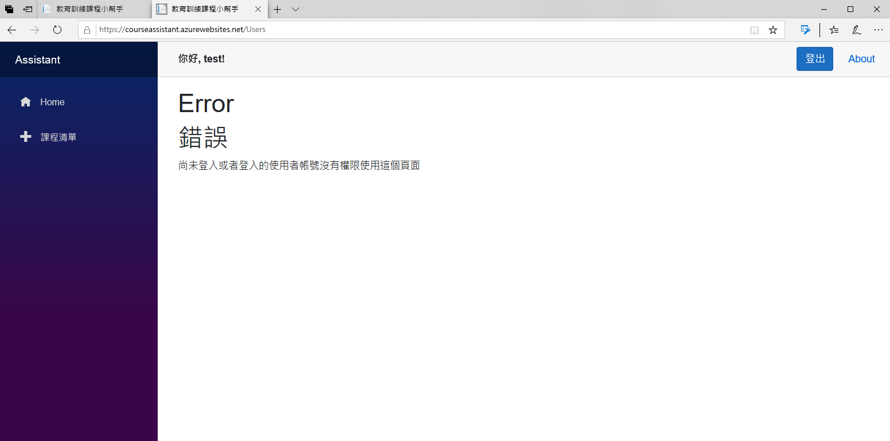

## CRUD 作業

這裡將會使用 課程維護 這個功能作為展示說明

首先是查詢，只要進入到 課程維護 功能後，就會看到底下畫面

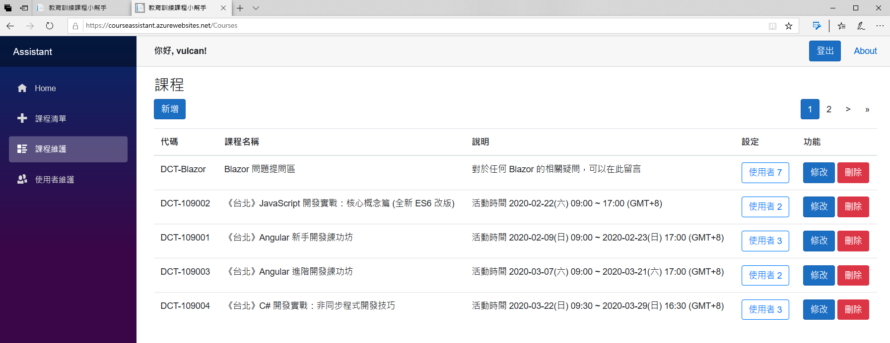

當資料透過 ASP.NET Core 內設計的相依插入服務功能，取得資料之後，就會透過 Blazor 的雙向資料綁定機制，將這些資料綁定到 HTML Table 相關標記上。

在這個應用程式也有設計分頁機制，當所要顯示的紀錄數量超過每頁數量設定，就會以分頁方式來顯示，分頁元件將會顯示在 右上方。

當點選 新增 或者 修改 按鈕，此時，就會彈出一個對話窗 Modal Dialog，可以讓使用者輸入資料，如底下截圖

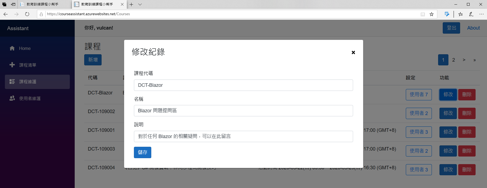

在該對話窗內所顯示的內容，將會使用 Blazor 元件這項功能，將這些 UI & 程式碼處理邏輯都一個 Component 元件內，如此，便可以達到重複使用目的

現在可以點選 刪除 按鈕，同樣會彈出一個對話窗，如下圖

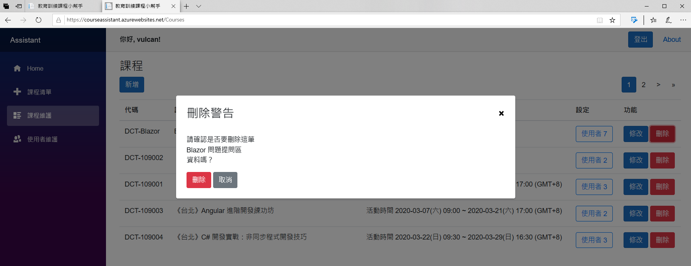

這裡將會詢問使用者是否要刪除這筆紀錄，使用者可以點選 取消 按鈕，或者點選螢幕上灰色區域，便可以取消此次刪除動作請求。

對於 CUD 新增 修改 刪除 這三個動作，當完成或者取消的時候，都會在螢幕的右下方看到彈出快顯通知視窗，如下圖

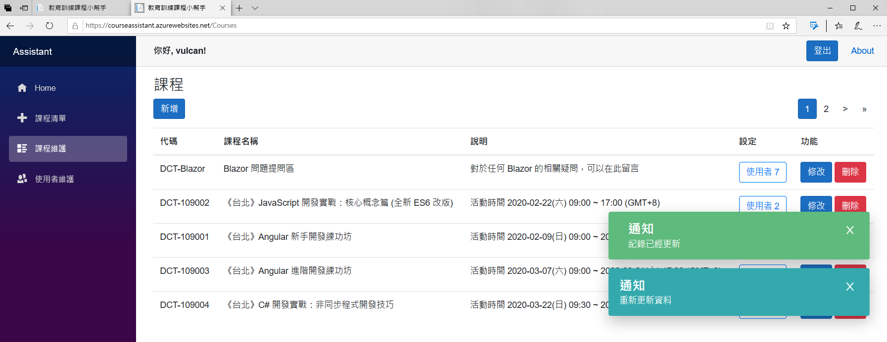

## 設定綁定使用者的彈出視窗功能

這個系統，可以設定使用者能夠看到或者參與那些課程，延續上面的課程維護畫面，每筆課程紀錄的右邊，將會看到一個使用者按鈕，按鈕文字可以看出這個課程有多少使用者可以使用；因此，當點選這個按鈕之後，便會取出這個系統內的所有使用者，顯示在對話窗上，如下圖

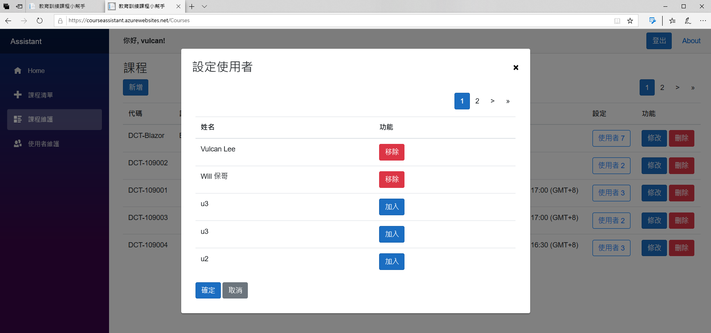

## 依照使用者顯示能看到的資料

這樣的需求也是經常出現在一般專案設計上，因此，在這裡切換另外一個使用者 test 這個使用者僅能夠看到兩個課程，如下圖

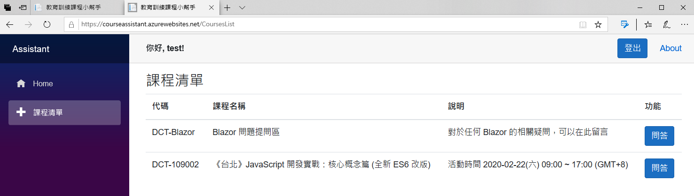

為了展示這項功能，所以又再切換另外一個使用者 u1 這個使用者僅能夠看到三個課程，如下圖

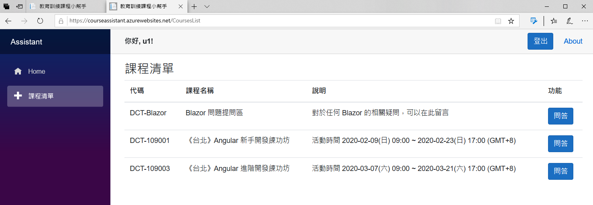

## 問題提出與回答

當要提出問題與回答問題的時候，需要在課程清單畫面上的某個課程紀錄右方的 問答 按鈕，把它點選下去，就會出現底下畫面

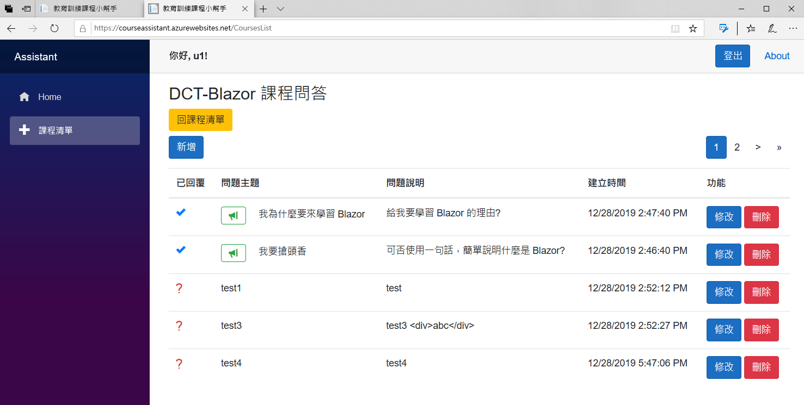

要注意的是，這個畫面沒有專屬 URL 可以直接進入，一定需要先從課程清單頁面看到可以參加的課程，才能夠進入到這裡，這樣對於有些需要適度安全保護的設計需求，是可以提供不錯的選擇。

在這裡，會判斷該問題是否已經回答過了，而顯示出不同的圖示與按鈕。

一般使用者，僅能夠提出問題與修改和刪除問題，回答問題的部分，需要具有管理者權限的使用者，才會看到，如下圖

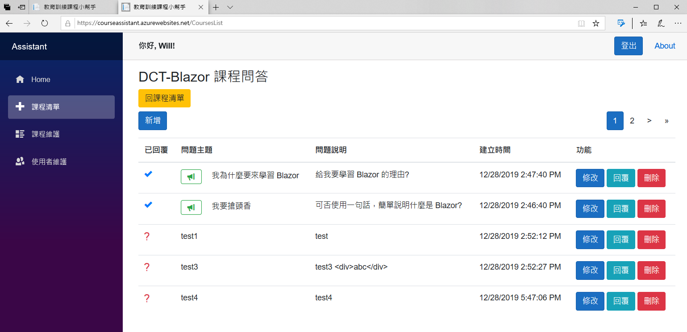

## 結論

當這個專案開發完成之後，我遇到了這些問題

* CSS / Bootstrap 不孰悉

  對於這樣的需求，通常是上網搜尋，看看能否有解決方案，不過，遇到這樣的問題，大多使版面排版上的問題。

* 第一次使用 Blazor 開發

  由於，這是我第一次使用 Blazor 來開發專案，因為，整個過程都在摸索一個制式或者標準的 CRUD 開發過程與模式，這裡也著實花費了不少時間，不過，一旦對於一個 CRUD 開發樣板模式準備好的話，要開發出其他資料表的 CRUD 需求，明顯的加快了許多

* 體驗第三方 Blazor 套件

  這個專案開發過程，我所寫的程式碼完全沒有直接呼叫到 JavaScript 程式碼，那麼，對於對話窗的彈出這樣的功能，又是如何做到的呢？這裡會有幾種作法，不過，我選擇的是使用別人包裝好的 Blazor 套件，就可以做到了。

* 對於 ASP.NET Core 3.1 平台孰悉度

  對於許多功能，都會直接使用 ASP.NET Core 平台上會用到的技術，例如：相依注入、抽象介面與具體服務實作的設計、資料庫存取使用到 Entity Framework Core、身分驗證則是自己來設計；對於這些功能的孰悉程度，將會影響到您的專案開發完成的時間

最後，我個人認為，Blazor 現階段已經開發出實用的 Web 專案，而且對於整體開發時間花費、開發過程的愉悅體驗，都是呈現極高的評價，我想，我將會開始使用 Blazor 來進行我夢想的網站開發了。
